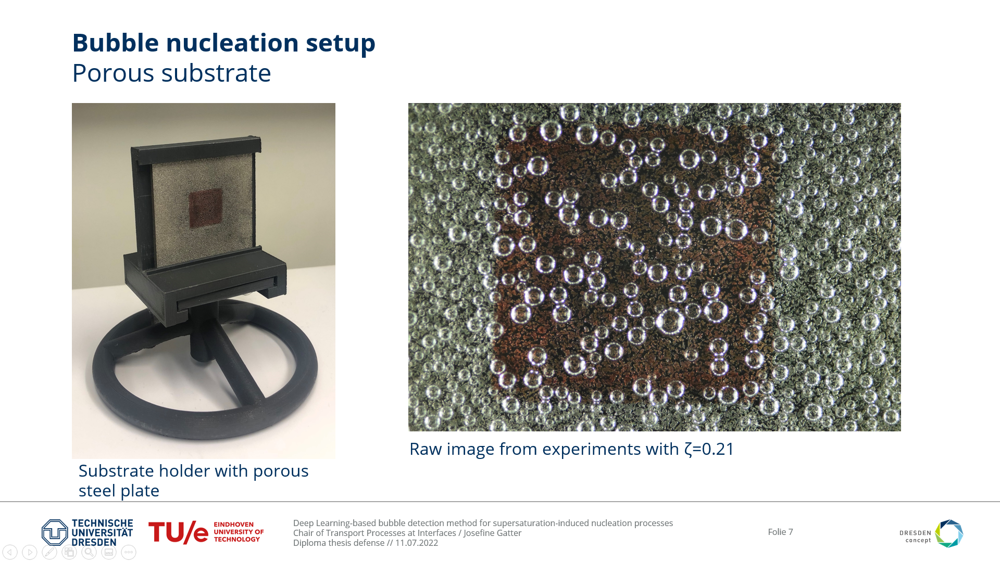
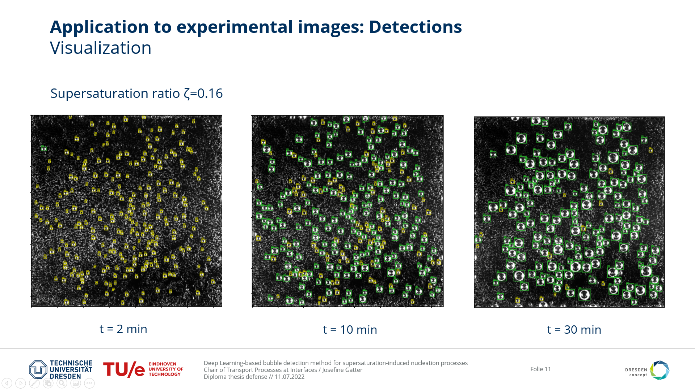
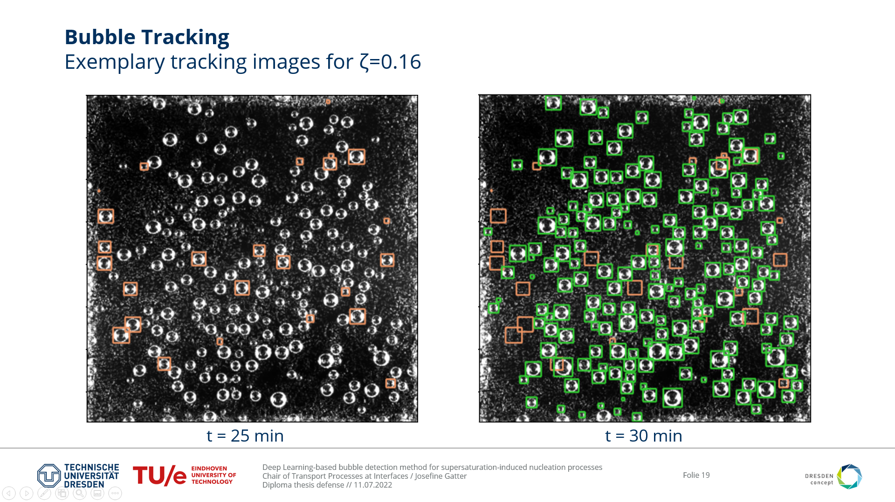

# Bubble Detection with Tensorflow Object Detection
This repository provides a set of codes used for the detection of gas bubbles nucleating on a porous substrate, from on images using the Tensorflow Object Detection API. 

## Purpose 
With the provided code one can train a Convolutional Neural Network (CNN) from the Tensorflow Model Zoo with custom images. Afterwards, the custom network can be used to detect bubbles on experimental images and evaluate important characteristics, such as the number of instances in an image, average bubble size, etc. The code also includes a bubble tracker used for detecting moving and detaching bubbles. See the following slides for details:

## Main Codes
* `1_Train_CNN_from_TFOD_Zoo.ipynb` Executes transfer learning with pretrained model from Tensorflow model Zoo
* `2_Test_CNN_on_new_imgs.ipynb` Get evaluation metrics of custom network on new images
* `3_Detection_and_Analysis.py` Make and visualize detections using the custom model on (experimental) images. Calculate and plot several bounding box/bubble characteristics.
* `4_BubbleTracker.py` Kalman Filter based Centroid Tracker for identifying dissapearing bubbles from image n to n+1 within a time series (experimental images from nucleation process)
* `5_Retrain_custom_CNN.ipynb` Train custom model again with new images.

## Usage
Some sample training images, artificially generated, are found in `Tensorflow/workspace/images/train`, and images ready for object detection, created by experiment, are found in `Tensorflow/workspace/images/22_03_30_Exp2`. Refer to the documentation files in the `doc` folder for details on how to set up the system for your own images, either training or object detection.

## Acknowledgement
The original code for TensorFlow Object Detection is based on the [Tensorflow Object Detection course by Nicolas Renotte](https://github.com/nicknochnack/TFODCourse). The further development for bubble nucleation experiments is done in a graduation project by Josefine Gatter MSc.

## More info
Read HowTo_BubTFOD

Diploma Thesis by Josefine Gatter: Characterization of the nucleation process for supersaturation-induced gas evolution with a Deep Learning-based bubble detection method (2022)
